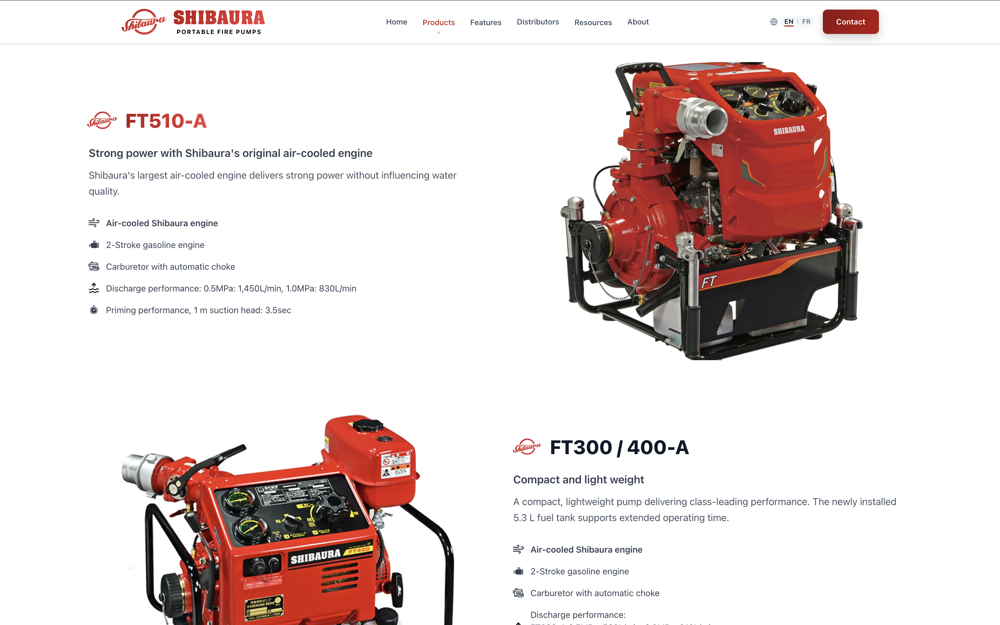
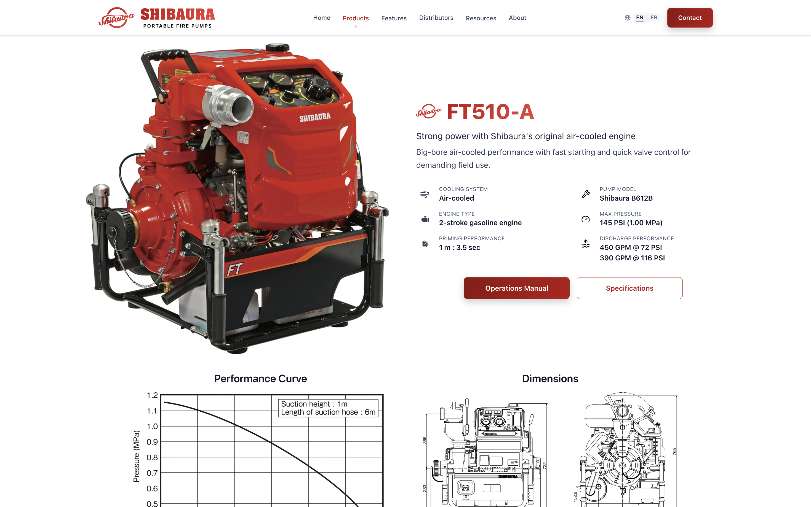
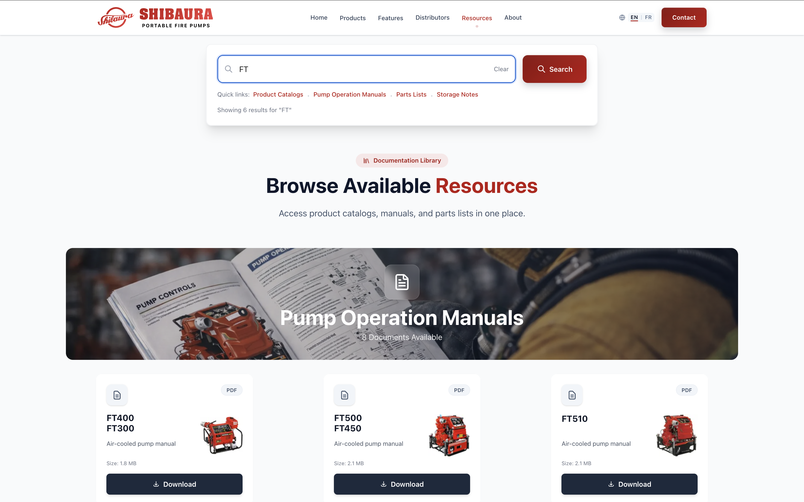

# Portable Fire Pumps Website


This repository documents a live production distributor website for **Shibaura portable fire pumps**, built for **Kojex International** to deliver product information, technical documentation, and inquiry workflows for North American buyers and partners.

🌐 Live site: [https://www.portable-fire-pumps.com](https://www.portable-fire-pumps.com)

It is built with **Astro, React, Tailwind CSS, and TypeScript** using an Astro-first, low-JavaScript architecture.

## My Role

Although this repository is hosted under the **Kojex International** organization, the site architecture and implementation were developed by **Nicholas Matsumoto**.

- Migrated the legacy Wix site to a modern Astro static architecture
- Designed the modular fire pump product data system
- Implemented bilingual routing across the entire site (`/en/` and `/fr/`)
- Built product detail pages and technical documentation resources
- Structured the Resources section for manuals, catalogs, and parts references
- Implemented SEO metadata, sitemap generation, and environment-aware indexing behavior
- Deployed and maintained the production site on Netlify
- Preserved a low-JavaScript, Astro-first rendering model across the site

## Screenshots

### Homepage
Shows the bilingual marketing homepage, product positioning, and primary entry points into the catalog.


### Product Listing
Highlights the product family overview and category-driven navigation used to guide buyers to the right pump line.


### Product Detail (FT510)
Demonstrates the product detail architecture, including specifications, supporting media, and conversion-oriented content blocks.


### Resources & Documentation
Shows the documentation experience for manuals, catalogs, and technical resources that support evaluation and after-sales use.


## Architecture Highlights

- Astro-first architecture keeps most pages fully static and minimizes client-side JavaScript
- React islands are used only where interaction is required, such as forms and navigation
- Modular fire pump data files support scalable product detail rendering across models
- Bilingual route structure is maintained consistently under `/en/` and `/fr/`
- Static site generation supports fast delivery, crawlability, and SEO control
- The Resources section is structured as a documentation system for distributors and operators

## Project Background

Kojex International distributes Shibaura portable fire pumps, and this site provides the product information and technical resources needed by distributors, procurement teams, and emergency response organizations. It replaces a legacy Wix implementation with a modern static platform focused on maintainability, performance, bilingual publishing, and documentation delivery.

## Repository Purpose

This repository powers the Portable Fire Pumps website as a distributor-focused product information and technical documentation platform.

It is not an ecommerce storefront. The site is designed to:
- Present pump model pages and supporting product information
- Publish technical manuals, catalogs, parts lists, and related resources
- Support distributor-facing credibility and capture contact / RFQ inquiries

## Project Status

The project is under active development with a focus on product depth, technical clarity, and commercial usability.

Current priorities:
- Expanding model-specific product pages across the lineup
- Improving technical resources, manuals, and documentation coverage
- Refining SEO, performance, and lead-generation content across EN/FR routes

## ✨ Features

- **Bilingual EN/FR routing** across marketing, product, and documentation pages
- **Technical product detail pages** with structured specifications, media, and supporting resources
- **Documentation and resources system** for catalogs, manuals, and parts references
- **RFQ and contact workflow** using Netlify Forms and serverless email notifications
- **SEO-friendly static architecture** with canonical URLs, hreflang, sitemap, and structured data
- **Responsive design** for desktop, tablet, and mobile use
- **Low-JS Astro-first architecture** with interactive behavior isolated to React islands

## 🧱 Tech Stack

- **Astro 5** for routing and static page generation
- **React 19** for interactive UI islands
- **Tailwind CSS 4** for styling and responsive layouts
- **TypeScript** for type-safe components and structured data models
- **Lucide React** for interface iconography

## Component Conventions

Use **Astro components** by default. Astro-first architecture keeps runtime JavaScript low and improves page performance.

Astro components should be used for:
- Static content
- Page layouts
- SEO content
- Product detail pages
- Documentation pages

React components should be used only for:
- Interactive UI
- Forms
- Dynamic elements

Examples of valid React island usage:
- RFQ form
- Mobile navigation
- Interactive UI elements (tabs, reveal interactions, card toggles)

Minimize client-side JavaScript whenever possible. If a section can render statically, keep it in Astro.

## 📦 Pages Included

- **Home** - Brand overview and primary entry point into the site
- **Products** - Category listings and detailed pump model pages
- **Features** - Capability-focused pages for key pump systems and product advantages
- **Distributors** - Distributor network information and partner-facing content
- **Resources** - Catalogs, manuals, parts lists, and technical documentation
- **Contact / RFQ** - Inquiry capture and request-for-quote workflow

## 🌐 Bilingual Routing Structure

- English pages are served under `/en/...`
- French pages are served under `/fr/...`
- User-facing pages should be maintained as EN/FR route pairs
- Navigation and internal linking should stay aligned across both locales

## Route Naming Conventions

English routes:
- `/en/products/`
- `/en/resources/`
- `/en/features/`
- `/en/distributors/`

French routes:
- `/fr/products/`
- `/fr/resources/`
- `/fr/features/`
- `/fr/distributors/`

EN and FR routes should remain structurally aligned to support maintainability, localization consistency, and predictable navigation.

## 🚀 Quick Start

### Prerequisites

- Node.js 18+ and npm

### Installation

1. Clone this repository:
```bash
git clone https://github.com/Kojex-International/portable-fire-pumps.git
cd portable-fire-pumps
```

2. Install dependencies:
```bash
npm install
```

3. Start the development server:
```bash
npm run dev
```

4. Open [http://localhost:4321](http://localhost:4321) in your browser

## 📝 Configuration

### Site Configuration

Core site metadata, canonical URL handling, and social profile links are defined in `src/config/site.ts`:

```typescript
export const SITE = {
  title: 'Portable Fire Pumps',
  description: 'High-performance portable fire pumps for fire prevention and disaster relief sectors',
  url: 'https://www.portable-fire-pumps.com',
  author: 'Kojex International',
} as const;

export const SOCIAL_LINKS = {
  twitter: 'https://twitter.com/shibaura_bousai',
  facebook: 'https://www.facebook.com/profile.php?id=61556205597560',
  instagram: 'https://www.instagram.com/shibaura_fire_pump/',
  youtube: 'https://www.youtube.com/@shibaura6004',
} as const;
```

### Form Integration

The RFQ form (`src/components/forms/RFQForm.tsx`) is currently integrated with Netlify Forms and a serverless email workflow. If you need to adapt it for another backend or hosted form service:

1. **Option 1: Form Service** (Recommended for static sites)
   - Use [Formspree](https://formspree.io/), [Netlify Forms](https://www.netlify.com/products/forms/), or similar
   - Update the submission flow in `RFQForm.tsx`

2. **Option 2: Custom API**
   - Create an API endpoint or serverless function
   - Update the form submission handler accordingly

Example with Formspree:
```typescript
const handleSubmit = async (e: React.FormEvent<HTMLFormElement>) => {
  e.preventDefault();
  const formData = new FormData(e.currentTarget);
  
  const response = await fetch('https://formspree.io/f/YOUR_FORM_ID', {
    method: 'POST',
    body: formData,
    headers: { 'Accept': 'application/json' }
  });
  
  if (response.ok) {
    // Show success message
  }
};
```

## 🛠️ Available Scripts

| Command                | Action                                           |
| :--------------------- | :----------------------------------------------- |
| `npm install`          | Installs dependencies                            |
| `npm run dev`          | Starts local dev server at `localhost:4321`     |
| `npm run build`        | Build your production site to `./dist/`         |
| `npm run preview`      | Preview your build locally, before deploying     |
| `npm run audit:images` | Audit active image alt text and filename quality |
| `npm run astro ...`    | Run CLI commands like `astro add`, `astro check` |

## 📁 Project Structure

```
/
├── public/                   # Static files served as-is
├── src/
│   ├── archive/                # Archived template/legacy code and assets
│   ├── assets/                 # Source-managed images/graphics
│   ├── components/
│   │   ├── forms/              # RFQ/contact form components
│   │   ├── layout/             # Shared page layout primitives
│   │   ├── navigation/         # Header/footer/mobile navigation
│   │   ├── products/           # Product-specific rendering components
│   │   ├── react/              # React island components
│   │   ├── sections/           # Reusable page sections
│   │   └── ui/                 # Generic UI primitives
│   ├── config/                 # Site/navigation configuration
│   ├── data/
│   │   ├── firepumps.ts        # Compatibility re-export
│   │   └── firepumps/          # Modular firepump data system
│   │       ├── index.ts        # Public API + validation
│   │       ├── pumps/          # One file per pump model
│   │       ├── localize.ts
│   │       ├── validation.ts
│   │       ├── media.ts
│   │       ├── spec-utils.ts
│   │       ├── spec-types.ts
│   │       ├── types.ts
│   │       └── frReplacements.ts
│   ├── layouts/                # Base layout composition
│   ├── pages/
│   │   ├── en/                 # English routes
│   │   └── fr/                 # French routes
│   ├── styles/                 # Global styles
│   └── utils/                  # Utility helpers
├── astro.config.mjs
├── package.json
└── tsconfig.json
```

## Product Rendering Architecture

- Product detail pages use thin locale wrappers:
  - `src/pages/en/products/[slug].astro`
  - `src/pages/fr/products/[slug].astro`
- Shared product rendering is centralized in:
  - `src/components/products/ProductDetailPageContent.astro`
- Product content is sourced from the modular firepump data API (`getFirepumps(...)`), keeping page templates declarative and minimizing duplicated EN/FR markup.

### Product Page Flow

The current product page architecture flows from route wrappers to shared rendering and then to the firepump data layer.

```text
EN/FR Route
    ↓
[slug].astro
    ↓
ProductDetailPageContent.astro
    ↓
src/data/firepumps/index.ts
    ↓
pumps/<model>.ts
```

## Firepump Data Architecture

- `src/data/firepumps.ts` is a compatibility layer that re-exports from `src/data/firepumps/index.ts`.
- `src/data/firepumps/index.ts` assembles pump modules, runs validation, and exports `getFirepumps(locale)`.
- Each pump model is defined under `src/data/firepumps/pumps/`.
- Supporting modules are split by responsibility:
  - `localize.ts` (EN/FR value localization)
  - `validation.ts` (hero/spec schema validation)
  - `media.ts` (shared media/manual assets)
  - `spec-utils.ts` and `spec-types.ts` (spec table helpers/types)
  - `frReplacements.ts` (French normalization replacements)

## 🗂️ Asset Organization

- Store source-managed images and graphics in `src/assets/`
- Store direct public files (favicons, static media, non-bundled assets) in `public/`
- Keep product-related media grouped by model family where practical
- Keep archived/deprecated template assets under `src/archive/`

## Asset Naming Guidelines

- Use lowercase only
- Use kebab-case only
- Use descriptive names; avoid generic names like `image1`, `final-v2`, `IMG_1234`
- Include model numbers when relevant
- Keep hero/support images separate from product/model assets
- Archive deprecated assets rather than deleting them

Recommended naming patterns:
- Product photos: `shibaura-{model}-portable-fire-pump-{view}.ext`
- Performance overview images: `{model}-performance-overview-graph.ext`
- Performance charts: `{model}-performance-curve.ext`
- Dimensions diagrams: `{model}-dimensions-diagram.ext`
- Hero/support images: `{context}-{role}.ext`
- Brand assets: `shibaura-wordmark.ext`, `shibaura-logo-mark.ext`

Examples:
- `shibaura-ff500ar-portable-fire-pump-side-view.jpg`
- `ft510-performance-overview-graph.png`
- `ff500-dimensions-diagram.jpg`
- `distributors-network-hero.png`
- `shibaura-wordmark.svg`

## Alt Text Standards

- Meaningful content images must have descriptive alt text
- Decorative images should use `alt=""`
- Describe the image naturally; do not repeat filenames
- Avoid keyword stuffing
- Include model/context where useful for product and technical imagery

Examples:
- `Side view of the Shibaura FT510 portable fire pump`
- `Performance curve for the Shibaura P572S portable fire pump`
- `Diagram showing a portable fire pump relay system used in wildfire operations`

### Image Audit

Run `npm run audit:images` to scan active source files for:
- `` or `<Image>` tags missing `alt`
- weak literal alt values such as `image`, `photo`, `picture`, or `logo`
- generic asset filename references in active imports

Scope: `src/pages/`, `src/components/`, `src/layouts/` (excluding archived content).

## 🎨 Customization

### Colors

The site uses Tailwind CSS. Customize colors in `src/styles/global.css` or update Tailwind config.

### Images

Store production images in `src/assets/` and public static media in `public/`.

### Content

- Update page and section copy in `src/pages/` and related components
- Modify navigation in `src/config/site.ts`
- Maintain EN/FR parity for user-facing pages
- Keep product/resource data aligned with `src/data/`

## ➕ Adding a New Pump Model

1. Add a new model file under `src/data/firepumps/pumps/`.
2. Export/include it in `src/data/firepumps/index.ts` so it is part of the validated `firepumps` array.
3. Add required media/manual assets via `src/data/firepumps/media.ts` (or existing asset/data locations as appropriate).
4. Verify EN/FR product detail routes resolve via `src/pages/en/products/[slug].astro` and `src/pages/fr/products/[slug].astro`.
5. Confirm listing/card surfaces include the new model where needed.
6. Run `npm run build` and validate hero/spec/resources output for both locales.

## Page Creation Checklist

- Create EN route
- Create FR route
- Confirm route naming consistency
- Add metadata and title
- Confirm images load correctly
- Confirm internal links
- Verify layout consistency
- Test page locally

## Pre-Deployment Checklist

- Run `npm run build` successfully
- Verify EN and FR routes exist for new pages
- Verify product pages render correctly
- Verify hero images load correctly
- Check console for build errors
- Verify internal navigation links
- Confirm RFQ form still works
- Confirm assets are located in correct directories

## 🚢 Deployment

### Build for Production

```bash
npm run build
```

This creates a `dist/` folder with your static site.

### Deploy to Vercel

[](https://vercel.com/new)

### Deploy to Netlify

[](https://app.netlify.com/start)

### Other Platforms

The `dist/` folder can be deployed to any static hosting service:
- GitHub Pages
- Cloudflare Pages
- AWS S3 + CloudFront
- Any static hosting provider

## Template Acknowledgment

This project was originally bootstrapped from an Astro website template created by **Sudeep**.

Original template source:
https://github.com/sudeep2003

The repository has since been significantly modified and adapted to power the **Portable Fire Pumps** distributor website operated by **Kojex International**. Most of the site structure, content, and components have been customized for this project.

The original template is licensed under the MIT License. The original license notice is preserved in the repository.

## 📄 License

This project is licensed under the MIT License - see the [LICENSE](LICENSE) file for details.


## 🤝 Contributing

Contributions, issues, and feature requests are welcome. Please open an issue in this repository.

## ⭐ Show Your Support

If you find this repository useful, please give it a star on GitHub.

## 📧 Support

For questions or support, please open an issue on GitHub.

Built with [Astro](https://astro.build)
